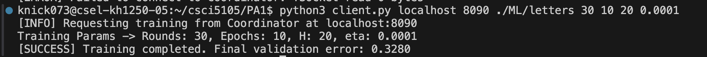
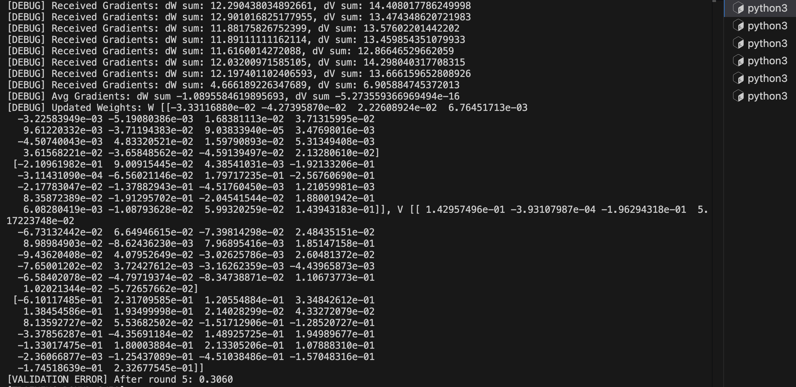

# Distributed Systems: Project 1

### Jun-Ting Hsu (hsu00191@umn.edu), Thomas Knickerbocker (knick073@umn.edu)

## Running Our Code:

Results after 10 epochs w/ client command:
`python3 client.py localhost 9090 ./ML/letters 30 10 20 0.0001`
- A 0.0 load probability amongst 4 nodes
- A coordinator scheduling_policy of 1:
  

Results after 5 epochs w/ client command:
`python3 client.py localhost 9090 ./ML/letters 50 75 20 0.0001`
- A 0.0 load probability amongst 4 nodes
- A coordinator scheduling_policy of 1:
  

1. In Coordinator Terminal: 
`python3 coordinator.py 9090 1`

2. For each compute node, in a terminal: 
`python3 compute_node.py <portNo> 0.0`

3. In Client Terminal: 
`python3 client.py localhost 9090 ./ML/letters 50 75 20 0.0001`

# TODO: Adjust port numbers in compute_nodes.txt before submitting