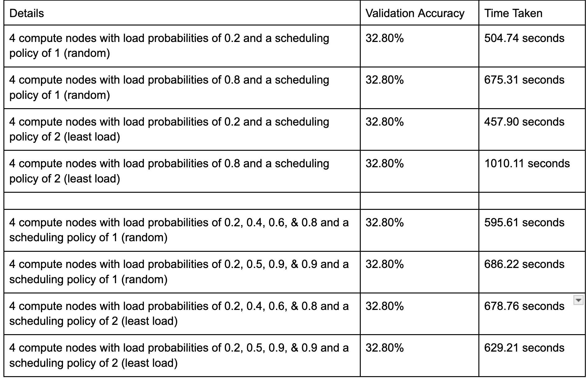

# Distributed Systems: Project 1

### Jun-Ting Hsu (hsu00191@umn.edu), Thomas Knickerbocker (knick073@umn.edu)

## NOTE: if you get an 'invalid method name' error while trying to run code, it is likely that someone else is using the port of one of your compute nodes.

## Running Our Code:

Results after running w/ client command:
`python3 client.py localhost 9090 ./ML/letters 30 10 20 0.0001`
  

0. In any terminal, assuming you have thrift installed:
`thrift --gen py service.thrift`

1. In Coordinator Terminal: 
`python3 coordinator.py 9090 1`

2. For each compute node, in a terminal: 
`python3 compute_node.py <portNo> 0.0`

3. In Client Terminal: 
`python3 client.py localhost 9090 ./ML/letters 30 10 20 0.0001`
